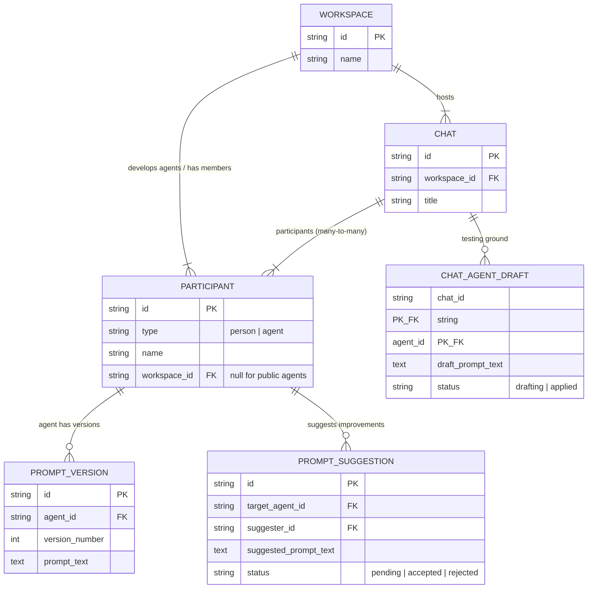
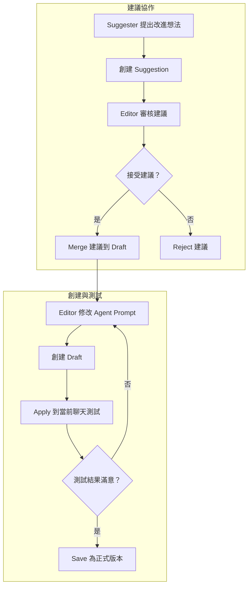
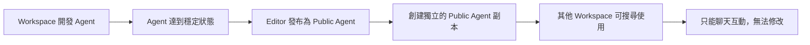
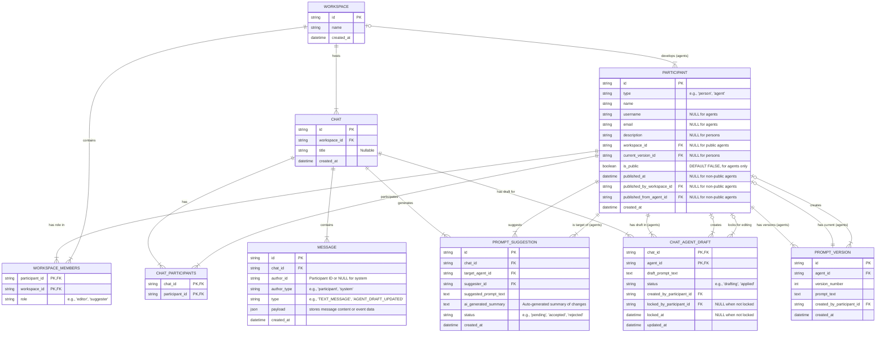
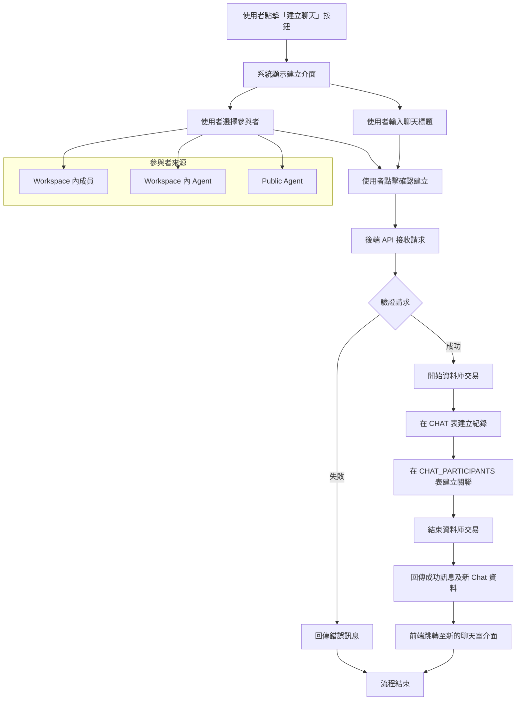
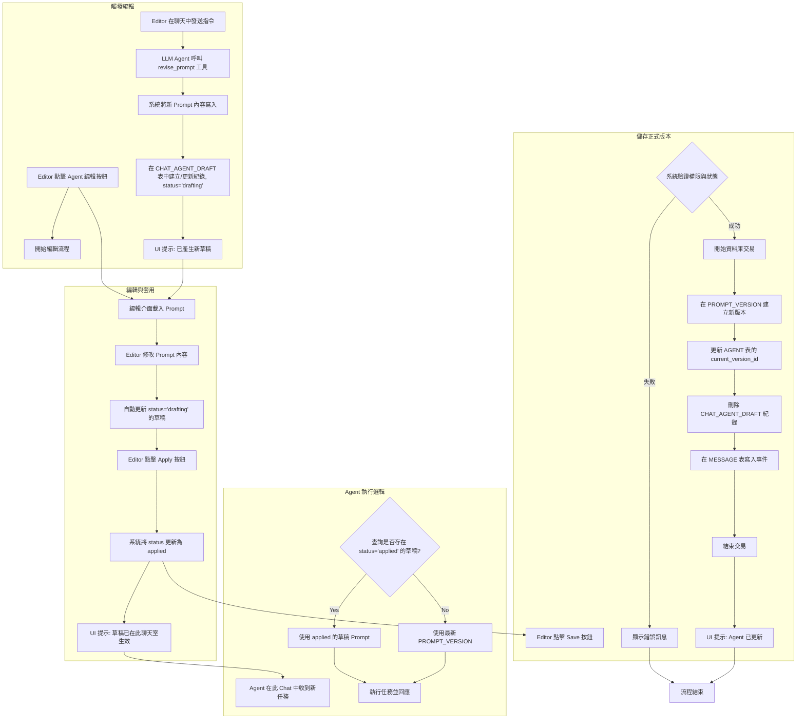
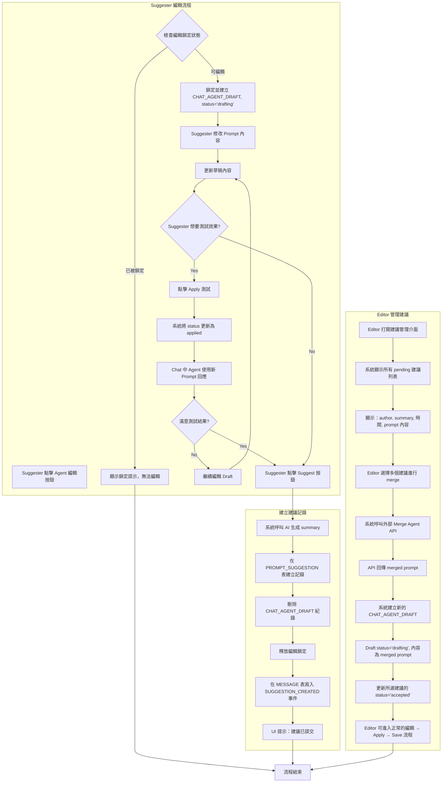

# **協作式 LLM Agent 平台系統架構設計文件**

*   **版本**：0.7 (Public Agent & Draft Lock Updated)
*   **日期**：2025年8月20日

## **1.0 系統概覽**

### 1.1 什麼是這個系統？

本系統是一個**團隊協作的 AI Agent 開發平台**，讓多人團隊在聊天室環境中共同創建、測試和完善 AI Agent。就像程式碼協作開發一樣，Agent 的 Prompt 也能透過團隊協作來持續改進。

### 1.2 核心價值主張

*   **協作式開發**: Agent 不是由單一開發者離線完成，而是在即時聊天中由整個團隊共同貢獻想法、測試和完善
*   **上下文感知**: Agent 的每次改進都與特定對話情境緊密相關，讓修改目標明確且有跡可循
*   **品質控制**: 透過角色分工確保創意自由流動的同時，維持 Agent 的穩定性和品質

### 1.3 關鍵概念

- **Workspace（工作區）**: 團隊協作的容器，包含成員、Agent 和聊天室
- **Participant（參與者）**: 系統中的使用者或 Agent，統一管理身份
- **Chat（聊天室）**: 實際與 Agent 互動、測試和改進的場所
- **Agent**: 可被協作開發的 AI 助手，有自己的 Prompt 和版本歷史
- **Editor vs Suggester**: 兩種角色，Editor 可直接修改 Agent，Suggester 只能提出建議

## **2.0 系統架構概覽**

### 2.1 概念 ERD (Entity Relationship Diagram)

以下是系統的核心實體關係圖，專注於主要概念而非完整的資料庫設計：



### 2.2 三層式 Prompt 管理模型

系統採用類似 Git 分支的概念來管理 Agent Prompt：

1. **正式版本 (Production)**: 穩定的 Agent Prompt，全域生效
2. **測試草稿 (Applied Draft)**: 僅在特定聊天室生效的測試版本
3. **編輯草稿 (Drafting)**: 正在編輯中的暫存版本

```
Agent 決策順序：
Chat 中的 Applied Draft > Agent 的 Current Version
```

### 2.3 角色與權限模型

| 角色 | Agent 修改 | 提出建議 | 版本發布 | 聊天參與 |
|------|------------|----------|----------|----------|
| **Editor** | ✅ 直接修改 | ❌ 不需要 | ✅ | ✅ |
| **Suggester** | ❌ 無法直接修改 | ✅ | ❌ | ✅ |

### 2.4 Public Agent 機制

- **發布分離**: Public Agent 是原 Workspace Agent 的獨立副本
- **純消費模式**: 其他 Workspace 只能使用 Public Agent，無法修改
- **版本獨立**: 原 Agent 更新不會影響已發布的 Public Agent

## **3.0 核心業務流程**

### 3.1 Agent 協作開發流程



### 3.2 聊天室互動模式

1. **創建聊天室**: 從 Workspace 成員、Agent 和 Public Agent 中選擇參與者
2. **實時對話**: 人員和 Agent 在聊天室中自然互動
3. **即時測試**: Applied Draft 讓 Agent 在特定聊天中使用新 Prompt
4. **協作改進**: 基於對話結果調整和完善 Agent

### 3.3 Public Agent 分享流程


## **4.0 技術實作規格**

### 4.1 資料庫設計原則

採用關聯式資料庫，遵循以下設計原則：

1. **統一參與者模型**: 人員和 Agent 統一存在 PARTICIPANT 表中
2. **事件溯源聊天**: MESSAGE 表記錄所有對話和系統事件
3. **正規化關聯**: 使用標準的 Join Table 處理多對多關係
4. **編輯互斥機制**: 透過鎖定機制避免並發編輯衝突

### 4.2 核心實體詳細規格

**PARTICIPANT**: 統一的參與者實體
- `type`: 'person' | 'agent' 
- `workspace_id`: 所屬工作區 (Public Agent 為 NULL)
- `is_public`: 是否為 Public Agent
- **Person 專有**: `username`, `email`
- **Agent 專有**: `description`, `current_version_id`

**WORKSPACE**: 協作工作區
- 包含成員 (WORKSPACE_MEMBERS) 和角色權限
- 託管私有 Agent 和聊天室

**CHAT**: 聊天互動空間
- 支援多參與者 (人員 + Agent)
- 記錄完整對話歷史和系統事件

**PROMPT_VERSION**: Agent 的正式版本
- 版本號遞增管理
- 記錄創建者和時間戳

**CHAT_AGENT_DRAFT**: 聊天室專用草稿
- `status`: 'drafting' | 'applied'
- 編輯鎖定機制 (`locked_by_participant_id`, `locked_at`)

### 4.3 業務邏輯約束

1. **Agent Prompt 選擇優先順序**:
   ```
   Chat 中的 Applied Draft > Agent Current Version
   ```

2. **編輯權限控制**:
   - 同一使用者同時只能編輯一個 Draft
   - Draft 編輯鎖定超時時間：30 分鐘

3. **Public Agent 發布限制**:
   - 名稱必須全域唯一
   - 同一原始 Agent 不可重複發布
   - 原 Agent 存在 Public Agent 時不可刪除

## **5.0 完整資料庫設計 (ERD)**

以下是完整的實體關係圖，包含所有欄位和約束：


## **6.0 詳細業務流程**

### 6.1 建立聊天室流程



### 6.2 Editor 管理 Agent Prompt 流程



### 6.3 Suggester 建議流程



## **7.0 待開發事項與決策**

### 7.1 高優先級待開發功能

1. **Public Agent 生命週期管理**:
   - 發布流程的詳細設計（UI/UX、API 流程）
   - Public Agent 的發現和搜尋機制
   - 下架流程和影響範圍管理

2. **通知系統**:
   - 聊天邀請、Prompt 建議等事件的通知機制

3. **初始設定與使用者管理**:
   - Workspace 創建流程
   - 使用者邀請加入 Workspace 的流程

### 7.2 技術實作細節確認

- Draft 編輯鎖定超時時間：30 分鐘
- Public Agent 名稱衝突處理：要求重新命名，不提供智能建議
- Message 的 JSON payload 在應用層進行 schema 驗證
- Agent Prompt 選擇邏輯：優先使用 applied draft，其次使用 current version
- Public Agent 名稱全域唯一性透過資料庫 UNIQUE 約束保證

### 7.3 未決定的設計議題

**Message Truncate 策略**：
- **問題**: Chat 中大量累積的 Message 會導致 Agent context 超出限制
- **目前假設**: 多數 Agent 使用場景為一問一答，不會有長時間的對話上下文需求
- **待釐清問題**：
  - Message 清理的觸發條件（數量？時間？context size？）
  - 清理策略（truncate？摘要？保留重要事件？）
  - 對 Agent 對話品質的影響評估

---

## **附錄：架構決策紀錄 (ADR)**

### **ADR-001：採用統一參與者模型 (Unified Participant Model)**
*   **狀態**：已接受
*   **背景**：原設計中 `PERSON` 和 `AGENT` 是分離的實體。這導致在處理如聊天參與者、權限分配等場景時，需要進行多型關聯查詢，增加了後端邏輯的複雜性和潛在的效能問題。
*   **決策**：廢棄 `PERSON` 和 `AGENT` 兩個獨立的表，引入一個統一的 `PARTICIPANT` 表。透過 `type` 欄位（'person', 'agent'）來区分不同類型的參與者。特定於類型的屬性（如 person 的 `email`，agent 的 `description`）作為可為空的欄位存在於該表中。
*   **後果**:
    *   **優點**:
        *   **簡化查詢**: 所有與參與者相關的查詢（如獲取聊天成員）都變得單一和直接，無需 `UNION` 或在應用層進行合併。
        *   **統一身份**: 簡化了權限、成員資格和稽核日誌（如 `created_by`）的模型，所有外鍵都統一指向 `participant.id`。
        *   **擴展性**: 未來若要引入新的參與者類型（如 'bot'），只需增加一個新的 `type` 枚舉值，而無需大的結構變更。
    *   **缺點**:
        *   **稀疏欄位**: 表中會存在「稀疏欄位」（Sparse Columns），即某些行在特定於類型的欄位上值為 NULL。但現代資料庫對 NULL 值的儲存和索引優化已非常高效，這在實踐中通常不是問題。

### **ADR-002：追蹤草稿建立者資訊**
*   **狀態**：已接受
*   **背景**：在 `CHAT_AGENT_DRAFT` 實體中，我們紀錄了特定聊天室中特定 Agent 的草稿內容和狀態，但缺少了「這份草稿是由誰建立或最後修改的」這一關鍵資訊。
*   **決策**：在 `CHAT_AGENT_DRAFT` 表中增加一個 `created_by_participant_id` 欄位，外鍵關聯到 `PARTICIPANT.id`。
*   **後果**:
    *   **優點**:
        *   **完整稽核**: 提供了完整的操作追溯鏈，對於除錯和理解協作流程至關重要。
        *   **支援未來功能**: 為將來可能的多 `editor` 並發編輯場景、精細化權限控制（如「只有草稿建立者才能編輯」）以及定向通知系統（如通知 `editor` 有人修改了他的草稿）奠定了基礎。
        *   **低成本高效益**: 實作成本極低（增加一個外鍵欄位），但為系統的健壯性和未來擴展性帶來了巨大價值。
### **ADR-003：Public Agent 採用發布分離模式**
*   **狀態**：已接受
*   **背景**：系統需要一種機制讓一個 Workspace 創建的優秀 Agent 能被其他 Workspace 使用。我們需要決定這種「使用」的邊界和形式，以平衡靈活性和複雜性。
*   **決策**：採用「發布分離」模式。當 Workspace Agent 被發布為 Public Agent 時，系統創建一個全新的獨立 Agent 實體（`PARTICIPANT.is_public=true`），與原始 Agent 完全分離。Public Agent 只能被加入聊天進行對話，不能被其他 Workspace 修改或產生草稿。
*   **後果**:
    *   **優點**:
        *   **完全隔離**: Public Agent 與原 Workspace Agent 各自獨立演進，避免跨 Workspace 的權限和同步問題。
        *   **簡化管理**: 發布後兩者無關聯，降低了系統複雜性。
        *   **穩定性保障**: Public Agent 作為穩定工具，保證一致的使用者體驗。
    *   **缺點**:
        *   **更新機制**: 原開發者只能透過下架舊版本、發布新版本來更新 Public Agent。
        *   **資料冗餘**: 每次發布都會創建新的 Agent 實體和 Prompt 版本。
*   **發布規則**:
        *   任何 Workspace Editor 都可發布 Agent
        *   Public Agent 名稱全域唯一，衝突時要求重新命名
        *   發布時只複製當前版本的 Prompt，版本號從 1 重新開始
        *   原 Workspace 存在 Public Agent 時不可刪除，必須先下架所有 Public Agent

### **ADR-004：聊天紀錄採用 JSON 事件載體設計**
*   **狀態**：已接受
*   **背景**：聊天室不僅需要記錄文字對話，還需要記錄一系列系統操作（如「草稿已更新」、「新版本已儲存」）。這些事件的結構各不相同，需要一種靈活的方式來儲存。
*   **決策**：將 `MESSAGE` 表設計成一個事件日誌。除了 `type` 欄位標識事件類型外，增加一個 `payload` 欄位，使用 JSON/JSONB 資料類型來儲存與該事件相關的結構化資料。
*   **後果**:
    *   **優點**:
        *   **極高擴展性**: 未來新增任何聊天事件，都無需修改資料庫表結構，只需定義新的 `type` 和 `payload` 格式。
        *   **完整追溯性**: 提供了對聊天室所有操作的完整稽核日誌。
        *   **狀態重現**: 理論上可根據事件日誌重現聊天室在任何時間點的狀態。
    *   **缺點**:
        *   **查詢效能**: 對 `payload` 欄位內的特定資料進行複雜查詢，效能可能低於傳統的結構化欄位。但在主要為追加寫、順序讀的場景下，這是可接受的。
        *   **資料一致性**: 需要在應用層確保寫入 `payload` 的資料結構是有效的。

### **ADR-005：實作三層式 Prompt 管理模型**
*   **狀態**：已接受
*   **背景**：系統核心功能是在聊天中協作迭代 Agent Prompt。需要一個機制，既能儲存正式版本，又允許在特定聊天中進行無風險測試，同時還能儲存未完成的編輯。
*   **決策**：實作一個三層式的 Prompt 管理模型：
    1.  **正式版本 (PromptVersion)**: Agent 的官方穩定版本。
    2.  **已套用草稿 (Applied Draft)**: `CHAT_AGENT_DRAFT` 中 `status='applied'` 的紀錄，僅在當前 Chat 生效，用於即時測試。
    3.  **編輯中草稿 (Drafting)**: `CHAT_AGENT_DRAFT` 中 `status='drafting'` 的紀錄，是未生效的編輯暫存。
*   **後果**:
    *   **優點**:
        *   **安全實驗**: 提供了安全的沙箱環境，Chat 內的 Prompt 修改不會污染全域的正式版本。
        *   **流程清晰**: 完美支援「編輯 -> 測試 -> 儲存」的完整協作流程。
        *   **類比 Git**: 概念上類似 Git 的分支模型，對開發者友好。
    *   **缺點**:
        *   **邏輯複雜**: Agent 決定使用哪個 Prompt 的邏輯鏈變長。
        *   **UI/UX 挑戰**: 前端需要清晰地向使用者展示當前 Agent 的生效狀態。

### **ADR-006：採用正規化 Join Table 處理多對多關係**
*   **狀態**：已接受
*   **背景**：系統需要處理多種多對多關係，如 Workspace 與 Participant、Chat 與 Participant。
*   **決策**：採用傳統的關聯式資料庫設計最佳實踐：為每一個多對多關係建立專門的中間表（Join Table），如 `WORKSPACE_MEMBERS` 和 `CHAT_PARTICIPANTS`。
*   **後果**:
    *   **優點**:
        *   **資料完整性**: 可利用資料庫外鍵約束保證關聯有效性。
        *   **查詢靈活性**: 可高效進行雙向查詢。
        *   **屬性附著**: 可以在關聯關係上附加屬性（如 `WORKSPACE_MEMBERS.role`）。
    *   **替代方案**: 曾考慮在父實體中使用 ID 陣列，但因其違反第一正規化、難以查詢和維護而被拒絕。

### **ADR-007：Draft 編輯互斥機制**
*   **狀態**：已接受
*   **背景**：在 Chat 中，多個 Editor 可能同時想要編輯同一個 Agent 的 Draft，需要防止並發編輯衝突。
*   **決策**：在 `CHAT_AGENT_DRAFT` 表中引入編輯鎖定機制。當 Editor 開始編輯 Draft 時，系統會鎖定該 Draft，其他 Editor 只能查看但無法修改。
*   **實作方式**：
        *   新增 `locked_by_participant_id` 欄位記錄當前編輯者
        *   新增 `locked_at` 欄位記錄鎖定開始時間，用於超時自動釋放
        *   設定鎖定超時機制（如 30 分鐘）防止編輯者意外離線造成永久鎖定
*   **後果**:
    *   **優點**:
        *   **避免衝突**: 確保同一時間只有一個 Editor 能修改 Draft
        *   **自動恢復**: 透過超時機制自動處理異常情況
    *   **缺點**:
        *   **增加複雜性**: 需要額外的鎖定管理邏輯
        *   **用戶等待**: Editor 可能需要等待其他人完成編輯

### **ADR-008：邊界情況處理策略**
*   **狀態**：已接受
*   **背景**：系統中存在多個邊界情況需要明確處理策略，包括 Agent 刪除限制、編輯鎖定範圍、Public Agent 重複發布等。
*   **決策**：採用簡化的邊界情況處理策略，優先系統穩定性而非使用者便利性。
*   **具體規則**:
        *   **Agent 刪除限制**: 已發布 Public Agent 的原 Workspace Agent 不可刪除，透過資料庫外鍵約束強制執行
        *   **編輯互斥擴展**: 單一使用者在任何時刻只能編輯一個 Agent Draft，透過 UI 層實作限制
        *   **重複發布防護**: 增加 `published_from_agent_id` 欄位追蹤發布來源，同一原始 Agent 不可重複發布
        *   **下架影響忽略**: Public Agent 被下架時不考慮對使用中 Chat 的影響，由使用者自行處理
*   **後果**:
    *   **優點**:
        *   **實作簡單**: 避免複雜的狀態同步和通知機制
        *   **資料一致性**: 透過約束保證核心資料完整性
        *   **清晰邊界**: 使用者對系統限制有明確預期
    *   **缺點**:
        *   **使用者體驗**: 某些操作會因約束而被阻止，需要 UI 層提供清楚的錯誤說明
        *   **運維複雜度**: Workspace 解散需要預先下架所有 Public Agent

### **ADR-009：Message Truncate 策略暫緩**
*   **狀態**：待討論
*   **背景**：Chat 中大量累積的 Message 會導致 Agent context 超出限制，需要某種清理或摘要機制。
*   **目前假設**：多數 Agent 使用場景為一問一答，不會有長時間的對話上下文需求。
*   **待釐清問題**：
        *   Message 清理的觸發條件（數量？時間？context size？）
        *   清理策略（truncate？摘要？保留重要事件？）
        *   對 Agent 對話品質的影響評估

