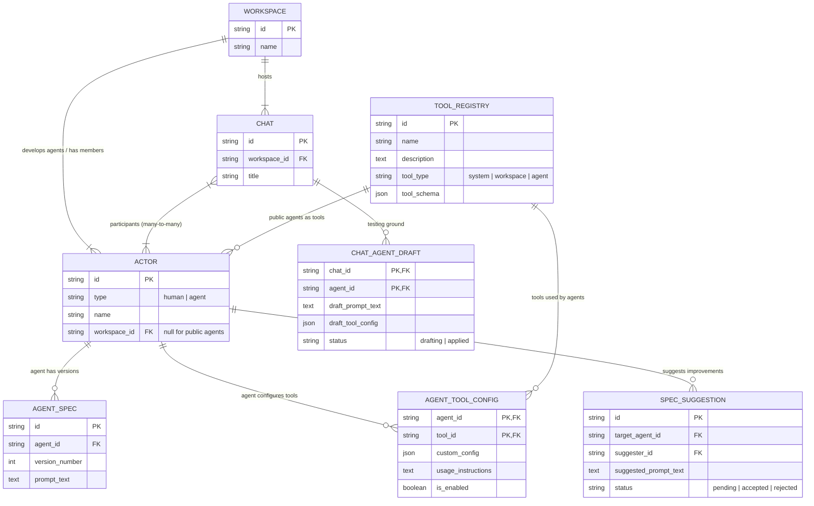
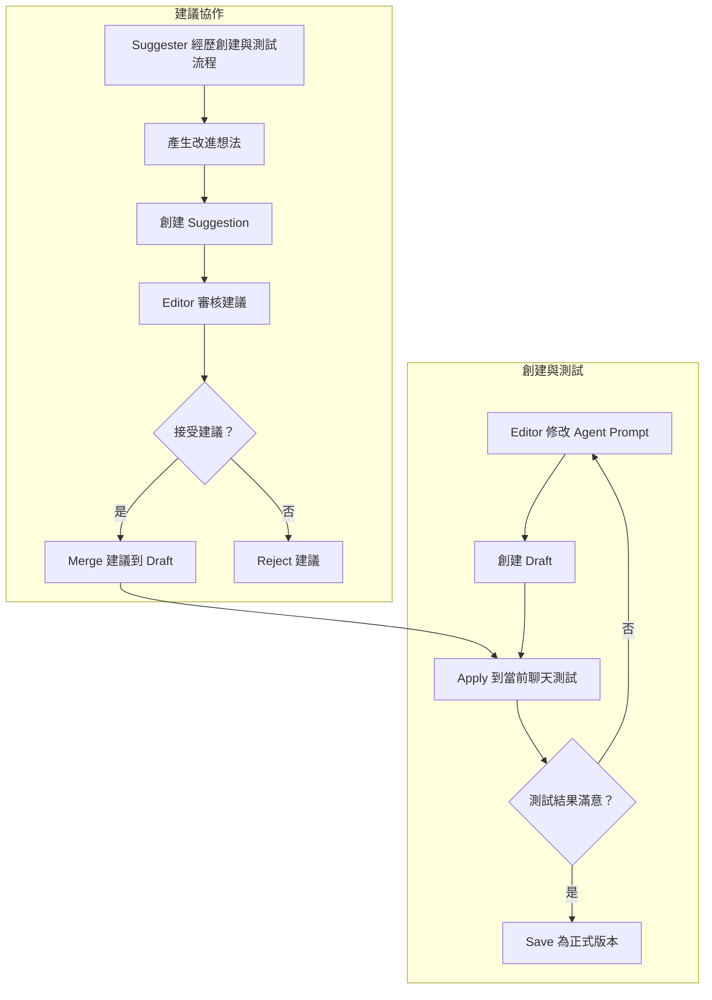
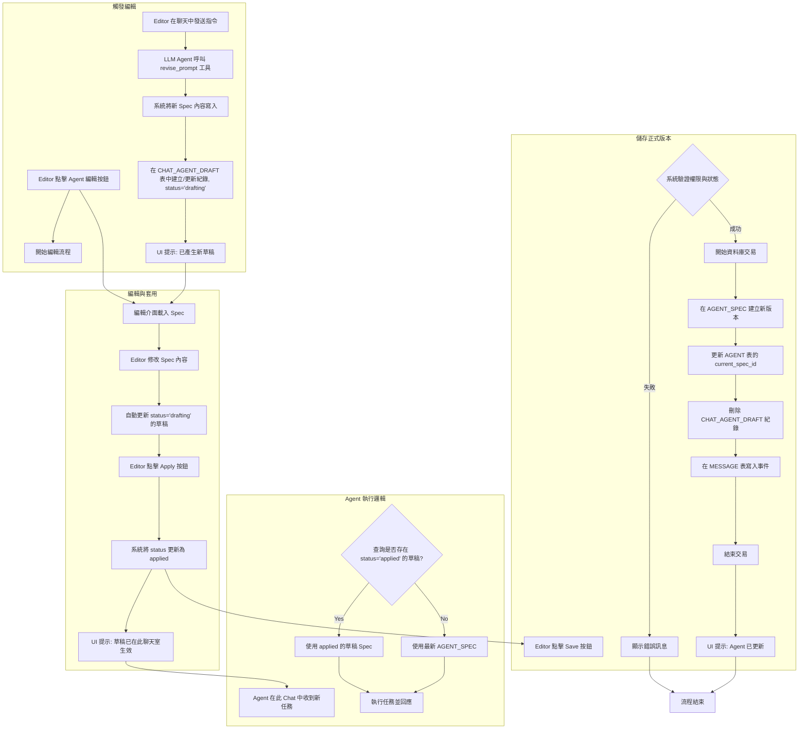

# **協作式 LLM Agent 平台系統架構設計文件**

* **版本**：0.9
* **日期**：2025年8月26日

## **1.0 系統概覽**

### 1.1 系統介紹

本系統是一個**團隊協作的 AI Agent 開發平台**，讓多人團隊在聊天室環境中共同創建、測試和完善 AI Agent。系統的核心特色是**使用 Agent 和調校 Agent 在同一個聊天環境中完成**，讓團隊能夠即時與 Agent 互動、發現問題並立即進行改進，形成完整的開發循環。就像程式碼協作開發一樣，Agent 的 Spec 也能透過團隊協作來持續改進。

### 1.2 核心價值主張

* **協作式開發**: Agent 不是由單一開發者離線完成，而是在即時聊天中由整個團隊共同貢獻想法、測試和完善
* **上下文感知**: Agent 的每次改進都與特定對話情境緊密相關，讓修改目標明確且有跡可循
* **品質控制**: 透過角色分工確保創意自由流動的同時，維持 Agent 的穩定性和品質

### 1.3 關鍵概念

* **Workspace（工作區）**: 團隊協作的容器，包含Human、Agent 和Chat
* **Human（使用者）**: 系統中的真實使用者，可以擔任不同角色參與協作
* **Actor（參與者）**: 系統中的使用者或 Agent，統一管理身份
* **Chat（聊天室）**: 實際與 Agent 互動、測試和改進的場所
* **Agent**: 可被協作開發的 AI 助手，有自己的版本歷史，可配置使用不同的 Tool
* **Tool**: Agent 可調用的功能工具，包括系統內建功能（如網頁抓取、檔案操作）和 Agent as Tool（Public Agent 作為工具被其他 Agent 調用）
  * **Agent as Tool**: 透過 JSON Schema 定義介面，讓 Public Agent 可作為其他 Agent 的 Tool 使用，實現 Agent 間的協作與能力組合
* **Editor vs Suggester**: 兩種角色，Editor 可直接修改 Agent，Suggester 只能提出建議

## **2.0 系統架構設計**

### 2.1 概念 ERD (Entity Relationship Diagram)

以下是系統的核心實體關係圖，專注於主要概念而非完整的資料庫設計：



### 2.2 三層式 Spec 管理模型

系統採用三層式的 Spec 管理機制來支援協作開發流程：

1. **正式版本 (Production)**: 穩定的 Agent Spec，全域生效
2. **測試草稿 (Applied Draft)**: 僅在特定聊天室生效的測試版本
3. **編輯草稿 (Drafting)**: 正在編輯中的暫存版本

```text
Agent 決策順序：
Chat 中的 Applied Draft > Agent 的 Production Version
```

### 2.3 角色與權限模型

| 角色 | Agent 修改 | 提出建議 | 版本發布 | 聊天參與 |
|------|------------|----------|----------|----------|
| **Editor** | ✅ 直接修改 | ❌ 不需要 | ✅ | ✅ |
| **Suggester** | ❌ 無法直接修改 | ✅ | ❌ | ✅ |

### 2.4 Public Agent 機制

* **發布分離**: Public Agent 是原 Workspace Agent 的獨立副本
* **純消費模式**: 其他 Workspace 只能使用 Public Agent，無法修改
* **版本獨立**: 原 Agent 更新不會影響已發布的 Public Agent

## **3.0 業務流程設計**

### 3.1 Agent 協作開發流程



### 3.2 聊天室互動模式

1. **創建聊天室**: 從 Workspace 成員、Agent 和 Public Agent 中選擇參與者
2. **實時對話**: 人員和 Agent 在聊天室中自然互動
3. **即時測試**: Applied Draft 讓 Agent 在特定聊天中使用新 Prompt
4. **協作改進**: 基於對話結果調整和完善 Agent

### 3.3 Public Agent 分享流程


## **4.0 技術實作規格**

### 4.1 資料庫設計原則

採用關聯式資料庫，遵循以下設計原則：

1. **統一參與者模型**: 人員和 Agent 統一存在 PARTICIPANT 表中
2. **事件溯源聊天**: MESSAGE 表記錄所有對話和系統事件
3. **正規化關聯**: 使用標準的 Join Table 處理多對多關係
4. **編輯互斥機制**: 透過鎖定機制避免並發編輯衝突

### 4.2 核心實體詳細規格

**ACTOR**: 統一的參與者實體

* `type`: 'human' | 'agent'
* `workspace_id`:
  * Human: NULL (全域使用者，透過 WORKSPACE_MEMBERS 加入多個 Workspace)
  * Agent: 必填 (專屬於特定 Workspace)
  * Public Agent: NULL (全域可用)
* **Human 專有**: `username`, `email` (全域唯一)
- **Agent 專有**: `description`, `current_spec_id`, `is_public`, `published_at`, `published_by_workspace_id`, `published_from_agent_id`

**WORKSPACE**: 協作工作區

* 包含成員 (WORKSPACE_MEMBERS) 和角色權限
* 託管私有 Agent 和聊天室
* 儲存 LLM API 金鑰用於 Agent 運行

**CHAT**: 聊天互動空間

* 支援多參與者 (人員 + Agent)
* 記錄完整對話歷史和系統事件

**AGENT_SPEC**: Agent 的正式版本

* 版本號遞增管理
* 記錄創建者和時間戳

**CHAT_AGENT_DRAFT**: 聊天室專用草稿

* `status`: 'drafting' | 'applied'
* `draft_tool_config`: JSON 格式的 Tool 配置草稿
* 編輯鎖定機制 (`locked_by_actor_id`, `locked_at`)

**TOOL_REGISTRY**: Tool 註冊表

* `tool_type`: 'system' (系統內建) | 'workspace' (工作區專用) | 'agent' (Agent 實作)
* `tool_schema`: JSON Schema 定義 Tool 完整規格（輸入參數、輸出格式等）

**AGENT_TOOL_CONFIG**: Agent Tool 配置

* `custom_config`: JSON 格式的客製化配置（重試次數、超時等）
* `usage_instructions`: Tool 的使用指引，會併入 Agent Spec
* `is_enabled`: 是否啟用此 Tool

### 4.3 業務邏輯約束

1. **Agent Spec 選擇優先順序**:

   ```text
   Chat 中的 Applied Draft > Agent Current Spec
   ```

2. **Agent Tool 使用邏輯**:

   ```text
   1. 查詢 Agent 的 AGENT_TOOL_CONFIG (is_enabled=true)
   2. 合併 Tool 的 tool_schema 與 custom_config
   3. 將 usage_instructions 併入 Agent Spec
   ```

3. **編輯權限控制**:
   * 同一使用者同時只能編輯一個 Draft
   * Draft 編輯鎖定超時時間：30 分鐘
   * **編輯鎖定機制的必要性**：當多個 Editor 同時嘗試修改同一 Agent 的 Draft 時，會產生並發編輯衝突，導致修改互相覆蓋或資料不一致。透過鎖定機制確保同一時間只有一個 Editor 能編輯特定 Draft，維護資料完整性並避免使用者的工作成果遺失。

4. **Human 與 Workspace 關係約束**:
   * Human (`type='human'`) 的 `workspace_id` 必須為 NULL
   * Human 的 `username` 和 `email` 全域唯一
   * Human 透過 `WORKSPACE_MEMBERS` 加入 Workspace，可擁有不同角色
   * Agent (`type='agent'`) 的 `workspace_id` 必須非 NULL（除非是 Public Agent）

5. **Public Agent 發布限制**:
   * 名稱必須全域唯一
   * 同一原始 Agent 不可重複發布
   * 原 Agent 存在 Public Agent 時不可刪除

## **4.4 Agent as Tool 設計**

### 4.4.1 核心概念

Agent as Tool 是系統的關鍵功能，允許 Public Agent 作為其他 Agent 的工具使用，實現 Agent 間的協作與能力組合。

**基本原理**:
* 每個 Public Agent 發布時，系統自動在 `TOOL_REGISTRY` 中創建對應的 Tool 記錄
* 其他 Agent 可透過標準的 Function Calling 機制調用這些 Agent Tool
* 在程式實作中，所有 Tool 類型（系統 Tool、Agent Tool）都實作統一的 Interface

### 4.4.2 業務約束

1. **只有 Public Agent 可作為 Tool**: 確保工具的穩定性和可用性
4. **調用計費**: Agent Tool 的 LLM 費用計入調用方 Workspace

### 4.4.3 使用情境範例

**情境**: 創建一個「市場分析專家」Agent，結合多個專業 Agent 能力

1. **Web Research Agent** (Public): 專門搜集網路資訊
2. **Data Analysis Agent** (Public): 專門分析數據趨勢  
3. **Report Writer Agent** (Private): 整合前兩者的結果產出報告

通過這種設計，Agent 生態系統具備了模組化、可組合的特性，讓複雜任務能透過多個專業 Agent 協作完成。

## **4.5 完整資料庫設計 (ERD)**

以下是完整的實體關係圖，包含所有欄位和約束：

```mermaid
erDiagram
    ACTOR {
        string id PK
        string type "e.g., 'human', 'agent'"
        string name
        string username UK "NULL for agents, UNIQUE for humans"
        string email UK "NULL for agents, UNIQUE for humans"
        string description "NULL for humans"
        string workspace_id FK "NULL for humans and public agents"
        string current_spec_id FK "NULL for humans"
        boolean is_public "DEFAULT FALSE, for agents only"
        datetime published_at "NULL for non-public agents"
        string published_by_workspace_id FK "NULL for non-public agents"
        string published_from_agent_id FK "NULL for non-public agents"
        datetime created_at
    }
    WORKSPACE {
        string id PK
        string name
        text llm_api_key "encrypted API key for agent execution"
        datetime created_at
    }
    WORKSPACE_MEMBERS {
        string actor_id PK,FK
        string workspace_id PK,FK
        string role "e.g., 'editor', 'suggester'"
    }
    TOOL_REGISTRY {
        string id PK
        string name UK
        text description
        string tool_type "system | workspace | agent"
        json tool_schema
        string source_agent_id FK "NULL for non-agent tools"
        datetime created_at
    }
    AGENT_TOOL_CONFIG {
        string agent_id PK,FK
        string tool_id PK,FK
        json custom_config "custom settings and parameters"
        text usage_instructions "instructions for agent on how to use this tool"
        boolean is_enabled "DEFAULT TRUE"
        datetime created_at
        datetime updated_at
    }
    AGENT_SPEC {
        string id PK
        string agent_id FK
        int version_number
        text prompt_text
        string created_by_actor_id FK
        datetime created_at
    }
    CHAT {
        string id PK
        string workspace_id FK
        string title "Nullable"
        datetime created_at
    }
    CHAT_ACTORS {
        string chat_id PK,FK
        string actor_id PK,FK
    }
    MESSAGE {
        string id PK
        string chat_id FK
        string author_id "Actor ID or NULL for system"
        string author_type "e.g., 'actor', 'system'"
        string type "e.g., 'TEXT_MESSAGE', 'TOOL_CALL', 'TOOL_RESPONSE'"
        json payload "stores message content or event data"
        datetime created_at
    }
    SPEC_SUGGESTION {
        string id PK
        string chat_id FK
        string target_agent_id FK
        string suggester_id FK
        text suggested_prompt_text
        text ai_generated_summary "Auto-generated summary of changes"
        string status "e.g., 'pending', 'accepted', 'rejected'"
        datetime created_at
    }
    CHAT_AGENT_DRAFT {
        string chat_id PK,FK
        string agent_id PK,FK
        text draft_prompt_text
        json draft_tool_config "tool configuration changes in draft"
        string status "e.g., 'drafting', 'applied'"
        string created_by_actor_id FK
        string locked_by_actor_id FK "NULL when not locked"
        datetime locked_at "NULL when not locked"
        datetime updated_at
    }

    %% Relationships
    ACTOR }|--|{ WORKSPACE_MEMBERS : "human joins multiple workspaces"
    WORKSPACE ||--|{ WORKSPACE_MEMBERS : "contains members"
    WORKSPACE ||--|{ CHAT : "hosts"
    WORKSPACE |o--|{ ACTOR : "owns agents"
    ACTOR ||--|{ AGENT_SPEC : "has versions (agents)"
    ACTOR |o--|| AGENT_SPEC : "has current (agents)"
    ACTOR |o--|{ AGENT_SPEC : "creates"
    ACTOR ||--|{ AGENT_TOOL_CONFIG : "has tool config (agents)"
    TOOL_REGISTRY ||--|{ AGENT_TOOL_CONFIG : "configured for agents"
    TOOL_REGISTRY |o--|| ACTOR : "public agent as tool source"
    CHAT }|--|{ CHAT_ACTORS : "has"
    ACTOR }|--|{ CHAT_ACTORS : "participates"
    CHAT ||--|{ MESSAGE : "contains"
    CHAT ||--|{ SPEC_SUGGESTION : "generates"
    ACTOR ||--|{ SPEC_SUGGESTION : "suggests"
    ACTOR ||--|{ SPEC_SUGGESTION : "is target of (agents)"
    CHAT ||--|{ CHAT_AGENT_DRAFT : "has draft for"
    ACTOR ||--|{ CHAT_AGENT_DRAFT : "has draft in (agents)"
    ACTOR |o--|{ CHAT_AGENT_DRAFT : "creates"
    ACTOR |o--|{ CHAT_AGENT_DRAFT : "locks for editing"
```



## **5.0 詳細業務流程**

### 5.1 建立聊天室流程


### 5.2 Editor 管理 Agent Spec 流程



### 5.3 Suggester 建議流程


## **6.0 待開發事項與決策**

### 6.1 高優先級待開發功能

1. **Public Agent 生命週期管理**:
   * 發布流程的詳細設計（UI/UX、API 流程）
   * Public Agent 的發現和搜尋機制
   * 下架流程和影響範圍管理

2. **通知系統**:
   * 聊天邀請、Prompt 建議等事件的通知機制

3. **初始設定與使用者管理**:
   * Workspace 創建流程
   * 使用者邀請加入 Workspace 的流程

### 6.2 技術實作細節確認

* **Human 全域唯一性**: `username` 和 `email` 透過資料庫 UNIQUE 約束保證全域唯一
* **權限檢查邏輯**: Human 的 Workspace 權限透過 `WORKSPACE_MEMBERS` 表查詢 `role` 欄位
* **Chat 參與者查詢**: 需要區分 Human（透過 WORKSPACE_MEMBERS 關聯）和 Agent（透過 workspace_id 直接關聯）
* **Tool 系統整合點**:
  * Tool 使用指引透過字串拼接方式併入 Agent Spec
  * Tool 調用採用 OpenAI 標準格式，支援 `tool_calls` 和 `tool_call_id` 追蹤
  * Agent 執行時動態載入 `AGENT_TOOL_CONFIG` 中 `is_enabled=true` 的 Tool
  * Tool 配置變更透過 `CHAT_AGENT_DRAFT.draft_tool_config` 進行協作編輯
* Draft 編輯鎖定超時時間：30 分鐘
* Public Agent 名稱衝突處理：要求重新命名，不提供智能建議
* Message 的 JSON payload 在應用層進行 schema 驗證
* Agent Spec 選擇邏輯：優先使用 applied draft，其次使用 production spec
* Public Agent 名稱全域唯一性透過資料庫 UNIQUE 約束保證

### 6.3 未決定的設計議題

**Message Truncate 策略**：

- **問題**: Chat 中大量累積的 Message 會導致 Agent context 超出限制
- **目前假設**: 多數 Agent 使用場景為一問一答，不會有長時間的對話上下文需求
- **待釐清問題**：
  - Message 清理的觸發條件（數量？時間？context size？）
    - 傾向採用 context size：於「新訊息發送／寫入」當下評估當前上下文的預估 token 數；若累計超過 `max_context_size`（依模型上限或由 Workspace/Agent 設定），立即觸發清理或降載流程。
  - 清理策略（truncate？摘要？保留重要事件？）
  - 對 Agent 對話品質的影響評估
- **自動切換為 RAG（選項）**：當超限時，將歷史訊息增量向量化並寫入檢索索引；後續回應改走 RAG 管線，以「當前請求 + 檢索到的 Top-K 相關歷史 + 關鍵系統事件」組裝模型上下文。此模式需保留最近數回合與重要事件，並於 UI 明示已啟用 RAG。


## **附錄：架構決策紀錄 (ADR)**

### **ADR-001：採用統一參與者模型 (Unified Actor Model)**

* **狀態**：已接受
* **背景**：原設計中 `HUMAN` 和 `AGENT` 是分離的實體。這導致在處理如聊天參與者、權限分配等場景時，需要進行多型關聯查詢，增加了後端邏輯的複雜性和潛在的效能問題。
* **決策**：廢棄 `HUMAN` 和 `AGENT` 兩個獨立的表，引入一個統一的 `ACTOR` 表。透過 `type` 欄位（'human', 'agent'）來区分不同類型的參與者。特定於類型的屬性（如 human 的 `email`，agent 的 `description`）作為可為空的欄位存在於該表中。
* **後果**:
  * **優點**:
    * **簡化查詢**: 所有與參與者相關的查詢（如獲取聊天成員）都變得單一和直接，無需 `UNION` 或在應用層進行合併。
    * **統一身份**: 簡化了權限、成員資格和稽核日誌（如 `created_by`）的模型，所有外鍵都統一指向 `actor.id`。
    * **擴展性**: 未來若要引入新的參與者類型（如 'bot'），只需增加一個新的 `type` 枚舉值，而無需大的結構變更。
  * **缺點**:
    * **稀疏欄位**: 表中會存在「稀疏欄位」（Sparse Columns），即某些行在特定於類型的欄位上值為 NULL。但現代資料庫對 NULL 值的儲存和索引優化已非常高效，這在實踐中通常不是問題。

### **ADR-002：追蹤草稿建立者資訊**

* **狀態**：已接受
* **背景**：在 `CHAT_AGENT_DRAFT` 實體中，我們紀錄了特定聊天室中特定 Agent 的草稿內容和狀態，但缺少了「這份草稿是由誰建立或最後修改的」這一關鍵資訊。
* **決策**：在 `CHAT_AGENT_DRAFT` 表中增加一個 `created_by_actor_id` 欄位，外鍵關聯到 `ACTOR.id`。
* **後果**:
  * **優點**:
    * **完整稽核**: 提供了完整的操作追溯鏈，對於除錯和理解協作流程至關重要。
    * **支援未來功能**: 為將來可能的多 `editor` 並發編輯場景、精細化權限控制（如「只有草稿建立者才能編輯」）以及定向通知系統（如通知 `editor` 有人修改了他的草稿）奠定了基礎。
    * **低成本高效益**: 實作成本極低（增加一個外鍵欄位），但為系統的健壯性和未來擴展性帶來了巨大價值。

### **ADR-003：Public Agent 採用發布分離模式**

* **狀態**：已接受
* **背景**：系統需要一種機制讓一個 Workspace 創建的優秀 Agent 能被其他 Workspace 使用。我們需要決定這種「使用」的邊界和形式，以平衡靈活性和複雜性。
* **決策**：採用「發布分離」模式。當 Workspace Agent 被發布為 Public Agent 時，系統創建一個全新的獨立 Agent 實體（`PARTICIPANT.is_public=true`），與原始 Agent 完全分離。Public Agent 只能被加入聊天進行對話，不能被其他 Workspace 修改或產生草稿。
* **後果**:
  * **優點**:
    * **完全隔離**: Public Agent 與原 Workspace Agent 各自獨立演進，避免跨 Workspace 的權限和同步問題。
    * **簡化管理**: 發布後兩者無關聯，降低了系統複雜性。
    * **穩定性保障**: Public Agent 作為穩定工具，保證一致的使用者體驗。
  * **缺點**:
    * **更新機制**: 原開發者只能透過下架舊版本、發布新版本來更新 Public Agent。
    * **資料冗餘**: 每次發布都會創建新的 Agent 實體和 Prompt 版本。
* **發布規則**:
        *任何 Workspace Editor 都可發布 Agent
        *   Public Agent 名稱全域唯一，衝突時要求重新命名
        *發布時只複製當前版本的 Prompt，版本號從 1 重新開始
        *   原 Workspace 存在 Public Agent 時不可刪除，必須先下架所有 Public Agent

### **ADR-004：聊天紀錄採用 JSON 事件載體設計**

* **狀態**：已接受
* **背景**：聊天室不僅需要記錄文字對話，還需要記錄一系列系統操作（如「草稿已更新」、「新版本已儲存」）。這些事件的結構各不相同，需要一種靈活的方式來儲存。
* **決策**：將 `MESSAGE` 表設計成一個事件日誌。除了 `type` 欄位標識事件類型外，增加一個 `payload` 欄位，使用 JSON/JSONB 資料類型來儲存與該事件相關的結構化資料。
* **後果**:
  * **優點**:
    * **極高擴展性**: 未來新增任何聊天事件，都無需修改資料庫表結構，只需定義新的 `type` 和 `payload` 格式。
    * **完整追溯性**: 提供了對聊天室所有操作的完整稽核日誌。
    * **狀態重現**: 理論上可根據事件日誌重現聊天室在任何時間點的狀態。
  * **缺點**:
    * **查詢效能**: 對 `payload` 欄位內的特定資料進行複雜查詢，效能可能低於傳統的結構化欄位。但在主要為追加寫、順序讀的場景下，這是可接受的。
    * **資料一致性**: 需要在應用層確保寫入 `payload` 的資料結構是有效的。

### **ADR-005：實作三層式 Spec 管理模型**

* **狀態**：已接受
* **背景**：系統核心功能是在聊天中協作迭代 Agent Spec。需要一個機制，既能儲存正式版本，又允許在特定聊天中進行無風險測試，同時還能儲存未完成的編輯。
* **決策**：實作一個三層式的 Spec 管理模型：
    1. **正式版本 (Agent Spec)**: Agent 的官方穩定版本。
    2. **已套用草稿 (Applied Draft)**: `CHAT_AGENT_DRAFT` 中 `status='applied'` 的紀錄，僅在當前 Chat 生效，用於即時測試。
    3. **編輯中草稿 (Drafting)**: `CHAT_AGENT_DRAFT` 中 `status='drafting'` 的紀錄，是未生效的編輯暫存。
* **後果**:
  * **優點**:
    * **安全實驗**: 提供了安全的沙箱環境，Chat 內的 Spec 修改不會污染全域的正式版本。
    * **流程清晰**: 完美支援「編輯 -> 測試 -> 儲存」的完整協作流程。
    * **類比 Git**: 概念上類似 Git 的分支模型，對開發者友好。
  * **缺點**:
    * **邏輯複雜**: Agent 決定使用哪個 Spec 的邏輯鏈變長。
    * **UI/UX 挑戰**: 前端需要清晰地向使用者展示當前 Agent 的生效狀態。

### **ADR-006：採用正規化 Join Table 處理多對多關係**

* **狀態**：已接受
* **背景**：系統需要處理多種多對多關係，如 Workspace 與 Actor、Chat 與 Actor。
* **決策**：採用傳統的關聯式資料庫設計最佳實踐：為每一個多對多關係建立專門的中間表（Join Table），如 `WORKSPACE_MEMBERS` 和 `CHAT_ACTORS`。
* **後果**:
  * **優點**:
    * **資料完整性**: 可利用資料庫外鍵約束保證關聯有效性。
    * **查詢靈活性**: 可高效進行雙向查詢。
    * **屬性附著**: 可以在關聯關係上附加屬性（如 `WORKSPACE_MEMBERS.role`）。
  * **替代方案**: 曾考慮在父實體中使用 ID 陣列，但因其違反第一正規化、難以查詢和維護而被拒絕。

### **ADR-007：Draft 編輯互斥機制**

* **狀態**：已接受
* **背景**：在 Chat 中，多個 Editor 可能同時想要編輯同一個 Agent 的 Draft，需要防止並發編輯衝突。
* **決策**：在 `CHAT_AGENT_DRAFT` 表中引入編輯鎖定機制。當 Editor 開始編輯 Draft 時，系統會鎖定該 Draft，其他 Editor 只能查看但無法修改。
* **實作方式**：
        *新增 `locked_by_participant_id` 欄位記錄當前編輯者
        *   新增 `locked_at` 欄位記錄鎖定開始時間，用於超時自動釋放
        *   設定鎖定超時機制（如 30 分鐘）防止編輯者意外離線造成永久鎖定
* **後果**:
  * **優點**:
    * **避免衝突**: 確保同一時間只有一個 Editor 能修改 Draft
    * **自動恢復**: 透過超時機制自動處理異常情況
  * **缺點**:
    * **增加複雜性**: 需要額外的鎖定管理邏輯
    * **用戶等待**: Editor 可能需要等待其他人完成編輯

### **ADR-008：邊界情況處理策略**

* **狀態**：已接受
* **背景**：系統中存在多個邊界情況需要明確處理策略，包括 Agent 刪除限制、編輯鎖定範圍、Public Agent 重複發布等。
* **決策**：採用簡化的邊界情況處理策略，優先系統穩定性而非使用者便利性。
* **具體規則**:
        ***Agent 刪除限制**: 已發布 Public Agent 的原 Workspace Agent 不可刪除，透過資料庫外鍵約束強制執行
        *   **編輯互斥擴展**: 單一使用者在任何時刻只能編輯一個 Agent Draft，透過 UI 層實作限制
        ***重複發布防護**: 增加 `published_from_agent_id` 欄位追蹤發布來源，同一原始 Agent 不可重複發布
        *   **下架影響忽略**: Public Agent 被下架時不考慮對使用中 Chat 的影響，由使用者自行處理
* **後果**:
  * **優點**:
    * **實作簡單**: 避免複雜的狀態同步和通知機制
    * **資料一致性**: 透過約束保證核心資料完整性
    * **清晰邊界**: 使用者對系統限制有明確預期
  * **缺點**:
    * **使用者體驗**: 某些操作會因約束而被阻止，需要 UI 層提供清楚的錯誤說明
    * **運維複雜度**: Workspace 解散需要預先下架所有 Public Agent

### **ADR-010：Human 與 Workspace 的多對多關係設計**

* **狀態**：已接受
* **背景**：原設計中 Human 透過 `ACTOR.workspace_id` 綁定到特定 Workspace，導致同一真實使用者在不同 Workspace 中會是不同實體。這造成使用者體驗不佳，無法追蹤跨 Workspace 活動，且違反了真實世界的使用模式。
* **決策**：重新設計 Human 與 Workspace 的關係為多對多：
    1. Human 的 `workspace_id = NULL`，成為全域使用者實體
    2. Agent 的 `workspace_id` 保持必填，仍專屬於特定 Workspace  
    3. 透過 `WORKSPACE_MEMBERS` 表管理 Human 加入多個 Workspace 的關係
    4. Public Agent 特殊處理：`workspace_id = NULL` 且 `is_public = true`
* **後果**:
  * **優點**:
    * **真實使用模式**: 符合使用者期望，一個帳號可參與多個團隊協作
    * **跨 Workspace 追蹤**: 可以追蹤使用者的完整活動歷史和貢獻
    * **簡化使用者管理**: 使用者只需註冊一次，可被邀請加入任何 Workspace
    * **保持概念清晰**: Human（全域）vs Agent（Workspace 專屬）的區別更明確
  * **缺點**:
    * **查詢複雜度**: Chat 參與者查詢需要區分 Human 和 Agent 的不同關聯方式
    * **權限檢查複雜度**: Human 的 Workspace 權限需要透過 JOIN WORKSPACE_MEMBERS 檢查
    * **資料遷移成本**: 需要合併現有的重複 Human 記錄
* **實作細節**:
        *Human 的 `username` 和 `email` 需要加上 UNIQUE 約束確保全域唯一性
        *   權限檢查邏輯：`SELECT role FROM workspace_members WHERE actor_id = ? AND workspace_id = ?`
        *   Chat 參與者查詢需要區分：Human 透過 WORKSPACE_MEMBERS 關聯，Agent 透過 workspace_id 直接關聯

### **ADR-011：Agent Tool 系統採用混合模式設計與 Agent as Tool**

* **狀態**：已接受
* **背景**：系統需要支援 Agent 調用外部工具來擴展能力，如網頁抓取、檔案操作、甚至調用其他 Agent。同時需要實現 Agent as Tool 概念，讓 Public Agent 能作為其他 Agent 的工具使用。需要設計一個既支援 Tool 複用，又允許 Agent 客製化使用方式的機制。
* **決策**：採用混合模式的 Tool 系統設計，整合 Agent as Tool 概念：
    1. **Tool 註冊表** (TOOL_REGISTRY)：統一管理系統 Tool 和 Agent Tool 的定義與 schema
    2. **Agent Tool 配置** (AGENT_TOOL_CONFIG)：Agent 特定的 Tool 使用配置  
    3. **Agent as Tool 自動註冊**：Public Agent 發布時自動註冊為 Tool
    4. **統一 Interface 實作**：所有 Tool 類型在程式層面實作相同接口
    5. **OpenAI 格式**：採用 OpenAI Tool Call 標準格式記錄 Message
* **後果**:
  * **優點**:
    * **模組化組合**: Agent 能透過調用其他 Agent 實現複雜功能組合
    * **生態系統**: 建立了 Agent 的可重用生態，促進協作與分享
    * **統一介面**: 程式實作層面無需區分不同類型的 Tool
    * **自動化**: Public Agent 發布即自動可用為 Tool，降低使用門檻
    * **標準化**: 採用 OpenAI 格式確保與主流 LLM API 一致性
  * **缺點**:
    * **執行複雜度**: Agent Tool 調用需要額外的執行環境和資源管理
    * **調用鏈追蹤**: 多層 Agent 調用的除錯和監控更加複雜
    * **費用計算**: 需要精確追蹤 Agent Tool 調用產生的 LLM 費用
* **實作要點**:
        *Public Agent 發布時自動生成標準化 Tool Schema
        *   Agent Tool 調用透過獨立執行環境，確保隔離性和安全性
        *   實作調用深度限制和超時控制，防止無限遞迴和資源濫用
        *   所有 Tool 類型在程式中實作統一的 `Tool` Interface
